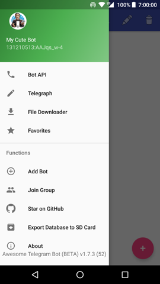
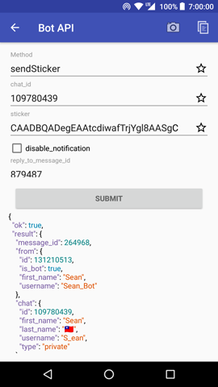
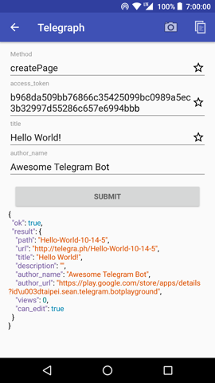
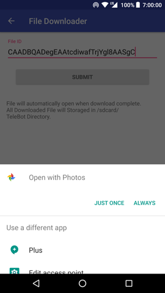

# Awesome Telegram Bot
Issues, Pull Requests are **always welcome**

## Features
* Have a complete list of APIs
* Automatic completion API method
* Automatic completion of the parameters
* Can quickly switch between different Bot

## Translators
Spanish 🇪🇸 by [Chaky El Pipe](https://telegra.ph/Biografía-Chaky-El-Pipe-07-24)  
Russian 🇷🇺 by [Smartman\_ru](https://github.com/smartmanru)  
Hindi 🇮🇳 by [Rishabh](https://github.com/lulzx)
Italian 🇮🇹 by [Eric Solinas](https://t.me/EricSolinas)
Chinese 🇹🇼 by [Sean](https://www.sean.taipei)  
If you would like to translate this app to your native language, please read [this gist](https://git.io/l10n).

## Screenshots

## Links
+ Google Play: [taipei.sean.telegram.botplayground](https://play.google.com/store/apps/details?id=taipei.sean.telegram.botplayground)
+ Telegram Group: [@AwesomeTeleBot](https://t.me/AwesomeTeleBot)
+ Bot API Tutorial: [從零開始的 Telegram Bot](https://blog.sean.taipei/2017/05/telegram-bot) (Chinese)

## License
[Apache 2](LICENSE) License
